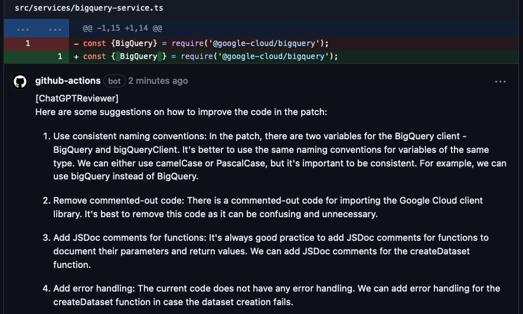

# Enhance### 🚀 **New in This Fork:**
- **🏗️ Structured Review Mode** - NOW DEFAULT! Organized JSON-formatted reviews with overall PR assessment
- **🎯 Accurate Line Targeting** - Comments now appear on the exact changed lines instead of file tops
- **🛠️ Custom Prompts** - Customize the review prompt with `CUSTOM_PROMPT` environment variable
- **🔄 Enhanced Fallback Strategies** - Multiple approaches to ensure comments are placed correctly
- **📊 Detailed Logging** - Better debugging information for troubleshooting
- **⚡ Improved Error Handling** - More robust API interaction with GitHub
- **📋 Smart Large File Handling** - Informative PR comments when files exceed token limitsT Code Reviewer

> **Forked from:** [magnificode-ltd/chatgpt-code-reviewer](https://github.com/magnificode-ltd/chatgpt-code-reviewer)  
> **Enhanced Version:** This fork includes improved line targeting, custom prompts, and better error handling.

An intelligent GitHub action that adds ChatGPT-powered code review comments directly to your pull requests. Uses the GitHub REST API and OpenAI API to provide instant, contextual feedback on code changes.

## ✨ Features

### 🚀 **New in This Fork:**
- **�️ Structured Review Mode** - NEW! Get organized JSON-formatted reviews with overall PR assessment
- **�🎯 Accurate Line Targeting** - Comments now appear on the exact changed lines instead of file tops
- **🛠️ Custom Prompts** - Customize the review prompt with `CUSTOM_PROMPT` environment variable
- **🔄 Enhanced Fallback Strategies** - Multiple approaches to ensure comments are placed correctly
- **📊 Detailed Logging** - Better debugging information for troubleshooting
- **⚡ Improved Error Handling** - More robust API interaction with GitHub
- **📋 Smart Large File Handling** - Informative PR comments when files exceed token limits

### 📋 **Core Features:**
- **Instant Code Reviews** - Get feedback immediately when PRs are created
- **Contextual Suggestions** - Comments appear inline on relevant code lines
- **Best Practices Focus** - Suggestions based on coding standards and patterns
- **Multiple AI Models** - Support for different OpenAI models
- **Token Management** - Handles large files with intelligent chunking
- **Transparent Processing** - Clear feedback when files are skipped with actionable recommendations

## 📸 Example



## 🎯 What to Expect

- **Complementary Tool**: This doesn't replace human code reviews - it catches things humans might miss
- **Instant Feedback**: Get suggestions immediately, before peer review
- **Critical Evaluation**: The AI isn't always right - use your judgment on which suggestions to implement

## ⚠️ Important Notice

By using this action, you acknowledge:
- Your code will be sent to OpenAI servers for analysis
- Authors are not responsible for any consequences of using this action
- You should review all suggestions before implementing them

---

## 🚀 Quick Setup

### Prerequisites
- GitHub account with a repository
- OpenAI API key ([Get one here](https://platform.openai.com/account/api-keys))

### 1. Add Required Secrets

Go to your repository → Settings → Secrets and variables → Actions, then add:

| Secret Name | Value | Description |
|-------------|-------|-------------|
| `OPENAI_API_KEY` | `sk-...` | Your OpenAI API key |
| `CUSTOM_PROMPT` | *Optional* | Custom review prompt (see examples below) |

### 2. Create Workflow File

Create `.github/workflows/chatgpt-reviewer.yml`:

```yml
name: ChatGPT Code Reviewer
on: [pull_request]

permissions:
  contents: read
  pull-requests: write
  issues: write

jobs:
  review:
    runs-on: ubuntu-latest
    steps:
      - name: ChatGPT Review
        uses: abdullahessam/chatgpt-code-reviewer@v1.4.2
        with:
          model: gpt-3.5-turbo  # Optional: gpt-4, gpt-3.5-turbo
          max_tokens: 4096      # Optional: Adjust based on needs
        env:
          GITHUB_TOKEN: ${{ secrets.GITHUB_TOKEN }}
          OPENAI_API_KEY: ${{ secrets.OPENAI_API_KEY }}
          CUSTOM_PROMPT: ${{ secrets.CUSTOM_PROMPT }}  # Optional
```

### 3. Repository Settings

Ensure your repository has these settings:
- **Actions enabled**: Settings → Actions → General → "Allow all actions"
- **Workflow permissions**: Settings → Actions → General → "Read and write permissions"

---

## ⚙️ Configuration

### Input Parameters

| Parameter | Description | Required | Default |
|-----------|-------------|----------|---------|
| `model` | OpenAI model to use | No | `gpt-3.5-turbo` |
| `max_tokens` | Maximum tokens per request | No | `4096` |

### Environment Variables

| Variable | Description | Required | Example |
|----------|-------------|----------|---------|
| `GITHUB_TOKEN` | GitHub access token (auto-provided) | ✅ Yes | `${{ secrets.GITHUB_TOKEN }}` |
| `OPENAI_API_KEY` | Your OpenAI API key | ✅ Yes | `sk-proj-...` |
| `CUSTOM_PROMPT` | Custom review instructions | ❌ No | See examples below |
| `CUSTOM_STRUCTURED_PROMPT` | Custom structured review prompt | ❌ No | Advanced users only |
| `SHOW_SKIPPED_FILES_COMMENT` | Show PR comment for large files | ❌ No | `true` (default) |

### Custom Prompt Examples

#### Security-Focused Reviews
```
CUSTOM_PROMPT: "You are a security-focused code reviewer. Analyze the code changes for potential security vulnerabilities, including SQL injection, XSS, authentication issues, and data exposure. Provide specific recommendations to improve security. Start every suggestion with the file path between @@ markers."
```

#### Performance-Focused Reviews
```
CUSTOM_PROMPT: "You are a performance optimization expert. Review the code changes for potential performance issues, inefficient algorithms, memory leaks, and optimization opportunities. Suggest specific improvements with examples. Start every suggestion with the file path between @@ markers."
```

#### General Best Practices (Default)
```
CUSTOM_PROMPT: "You are an experienced code reviewer. Analyze the code changes and provide suggestions for improving code quality, following best practices, and maintaining consistency. Include examples where helpful. Start every suggestion with the file path between @@ markers."
```

### 🏗️ Structured Review Mode (Default)

The ChatGPT Code Reviewer now uses structured reviews by default, providing comprehensive assessment:

```yml
- name: ChatGPT Structured Review
  uses: abdullahessam/chatgpt-code-reviewer@v1.4.2
  env:
    GITHUB_TOKEN: ${{ secrets.GITHUB_TOKEN }}
    OPENAI_API_KEY: ${{ secrets.OPENAI_API_KEY }}
```

**What You Get:**
- 📊 **Overall PR Assessment** - Quality score (1-10) and recommendation (APPROVE/REQUEST_CHANGES/COMMENT)
- 🎯 **Individual File Reviews** - Line-specific comments with severity and category classification
- 📋 **Comprehensive Summary** - High-level PR summary with actionable insights
- 🎨 **Enhanced Formatting** - Visual indicators with emojis and clear structure

**Review Output Example:**

*Overall PR Comment:*
```markdown
## 🤖 ChatGPT Code Review Summary
✅ **Recommendation:** APPROVE
### 📊 Overall Assessment
- **Quality Score:** ⭐⭐⭐⭐⭐⭐⭐⭐ (8/10)
- **Issues Found:** 3
### 📝 Summary
The code changes look good overall with some minor improvements needed.
```

*Individual Line Comments:*
```markdown
🚨 **ERROR** 🔒 (security)
This query is vulnerable to SQL injection. Use parameterized queries instead.
```

[📖 **Full Structured Review Guide**](STRUCTURED_REVIEW_GUIDE.md)

---

## 🔧 Advanced Configuration

### Multiple AI Models
```yml
strategy:
  matrix:
    model: [gpt-3.5-turbo, gpt-4]
steps:
  - name: ChatGPT Review (${{ matrix.model }})
    uses: abdullahessam/chatgpt-code-reviewer@v1.3.0
    with:
      model: ${{ matrix.model }}
```

### Conditional Execution
```yml
# Only run on specific file types
- name: ChatGPT Review
  if: contains(github.event.pull_request.changed_files, '.php') || contains(github.event.pull_request.changed_files, '.js')
  uses: abdullahessam/chatgpt-code-reviewer@v1.3.0
```

### Different Prompts for Different Paths
```yml
# Backend-focused review
# Backend-focused review
- name: Backend Review
  if: contains(github.event.pull_request.changed_files, 'backend/')
  uses: abdullahessam/chatgpt-code-reviewer@v1.3.0
  env:
    CUSTOM_PROMPT: "Focus on backend code quality, database interactions, API design, and security..."

# Frontend-focused review  
- name: Frontend Review
  if: contains(github.event.pull_request.changed_files, 'frontend/')
  uses: abdullahessam/chatgpt-code-reviewer@v1.3.0
  env:
    CUSTOM_PROMPT: "Focus on frontend code quality, React best practices, performance, and accessibility..."
```

---

## 🐛 Troubleshooting

### Common Issues

#### 1. Comments Not Appearing on Lines
**Problem:** Comments appear as general PR comments instead of inline  
**Solution:** Ensure you're using v1.1.0+ which includes enhanced line targeting

#### 2. "Resource not accessible by integration" Error
**Problem:** GitHub API permissions error  
**Solution:** Add these permissions to your workflow:
```yml
permissions:
  contents: read
  pull-requests: write
  issues: write
```

#### 3. OpenAI API Rate Limits
**Problem:** Too many requests to OpenAI  
**Solution:** 
- Use a lower `max_tokens` value
- Consider upgrading your OpenAI plan
- Add delays between large PR reviews

#### 4. Action Not Triggering
**Problem:** Workflow doesn't run on PRs  
**Solution:** 
- Check that Actions are enabled in repository settings
- Verify workflow file is in `.github/workflows/` directory
- Ensure proper YAML syntax

### Debug Mode

Enable detailed logging by setting debug mode in your workflow:

```yml
steps:
  - name: Enable Debug Logging
    run: echo "ACTIONS_STEP_DEBUG=true" >> $GITHUB_ENV
    
  - name: ChatGPT Review
    uses: abdullahessam/chatgpt-code-reviewer@v1.3.0
    # ... rest of config
```

---

## 📊 Version History

### v1.3.0 (Latest)
- ✅ **Added:** Informative PR comments for files that exceed token limits
- ✅ **Enhanced:** Smart large file handling with clear explanations
- ✅ **New:** `SHOW_SKIPPED_FILES_COMMENT` environment variable for control
- ✅ **Improved:** Better logging with emojis and detailed information
- ✅ **Fixed:** Proper dependency bundling for GitHub Actions runtime

### v1.2.0
- ✅ **Enhanced:** Comprehensive documentation with setup guides
- ✅ **Added:** Custom prompt examples for different review types
- ✅ **Improved:** Troubleshooting section and contribution guidelines
- ✅ **Updated:** Proper attribution to original repository

### v1.1.0
- ✅ **Fixed:** Comments now appear on correct lines instead of file tops
- ✅ **Enhanced:** Multi-strategy line targeting with fallback approaches
- ✅ **Added:** Detailed logging for better debugging
- ✅ **Improved:** Error handling and API interaction

### v1.0.0
- ✅ **Added:** Custom prompt support via `CUSTOM_PROMPT` environment variable
- ✅ **Enhanced:** Better configuration management
- ✅ **Improved:** Documentation and examples

### Original (magnificode-ltd)
- ✅ **Base:** Core ChatGPT code review functionality
- ✅ **Features:** OpenAI integration, GitHub API interaction

---

## 🤝 Contributing

Contributions are welcome! Here's how to get started:

1. **Fork this repository**
2. **Create a feature branch:** `git checkout -b feature/amazing-feature`
3. **Make your changes** and test them thoroughly
4. **Commit your changes:** `git commit -m 'Add amazing feature'`
5. **Push to the branch:** `git push origin feature/amazing-feature`
6. **Open a Pull Request**

### Development Setup

```bash
# Clone the repository
git clone https://github.com/abdullahessam/chatgpt-code-reviewer.git
cd chatgpt-code-reviewer

# Install dependencies
npm install

# Build the project
npm run build

# Test locally (requires .env file with API keys)
npm test
```

### Testing Your Changes

Before submitting a PR, test your changes:

1. **Create a test repository** with this action configured
2. **Make code changes** in a new branch
3. **Open a PR** and verify the action runs correctly
4. **Check comment placement** and content quality

---

## 📝 Dependencies

- **@actions/core:** GitHub Actions toolkit for workflow integration
- **@actions/github:** GitHub REST API interaction library
- **openai:** Official OpenAI API client library
- **gpt-3-encoder:** Token counting and text chunking utility

---

## 📝 License

This project is licensed under the MIT License - see the [LICENSE.md](LICENSE.md) file for details.

---

## 🙏 Acknowledgments

- **Original Project:** [magnificode-ltd/chatgpt-code-reviewer](https://github.com/magnificode-ltd/chatgpt-code-reviewer) - Thanks for the solid foundation!
- **OpenAI:** For providing the GPT models that power this tool
- **GitHub:** For the Actions platform and API
- **Community:** For feedback, issues, and contributions

### About MagnifiCode (Original Authors)

<a href="https://bit.ly/3nXn4EN">
   
</a>

The original repository was created & maintained by MagnifiCode. They provide web development services specializing in React/Node/AWS and are available for [hire](https://bit.ly/3IcWXR3). Learn more about them on their [website](https://bit.ly/3nXn4EN).

Follow them on [Twitter](https://twitter.com/magnificodehq) and [LinkedIn](https://www.linkedin.com/company/magnificode-software) for more updates.

---

## 📞 Support

### Getting Help

1. **Check the [Issues](https://github.com/abdullahessam/chatgpt-code-reviewer/issues)** for existing solutions
2. **Read the troubleshooting section** above
3. **Review the [original repository](https://github.com/magnificode-ltd/chatgpt-code-reviewer)** for additional context

### Reporting Issues

When reporting issues, please include:
- Your workflow configuration (remove sensitive data)
- Error messages from the Actions log
- Steps to reproduce the problem
- Expected vs actual behavior

### Feature Requests

Have an idea for improvement? Open an issue with:
- Clear description of the feature
- Use case and benefits
- Possible implementation approach

---

**⭐ If this action helped your project, please consider giving it a star!**

> Built with ❤️ by [Abdullah Essam](https://github.com/abdullahessam)  
> Enhanced from the original work by [MagnifiCode](https://github.com/magnificode-ltd)
